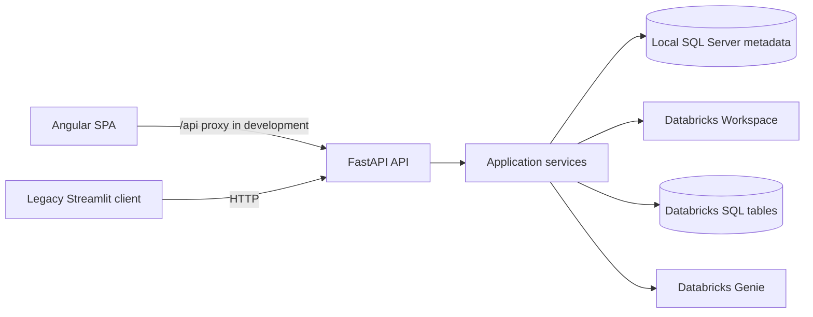

# Architecture

## Purpose

Data Health Monitor helps an operator turn a health-check definition and
Databricks metadata into generated validation SQL, then save and execute that
SQL. The system combines Unity Catalog discovery, payor-specific configuration,
and Databricks Genie context generation.

## Components

The browser and legacy client are consumers of the same REST API. The browser
uses Angular's development proxy for local development. The Streamlit client
uses `http://127.0.0.1:8000` directly.

## Backend layers

| Layer | Location | Responsibility |
| --- | --- | --- |
| Application composition | `backend/main.py` | FastAPI creation, lifespan, middleware, exceptions, router registration |
| HTTP API | `backend/api/` | Routes, request models, dependency construction, prompts, error translation |
| Domain models | `backend/models/` | Pydantic request, response, persistence, Genie, metadata, and batch models |
| Services | `backend/services/` | Databricks calls and workflow rules |
| Repository | `backend/repositories/` | SQLAlchemy persistence for metadata snapshots; transitional JSON compatibility implementation |
| Database | `backend/database/` | SQLAlchemy engine, request-scoped sessions, and SQL Server ORM entities |
| Configuration and logging | `backend/config/`, `backend/core/` | Environment settings and structured rotating logs |

Routes do not access Databricks directly. FastAPI dependencies construct the
needed service for each request. Services encapsulate the domain behavior and
external SDK interactions.

## Application lifecycle

`backend.main:app` configures logging, request observability, exception
handling, and the `/api/v1` router. During its lifespan startup it creates a
thread lock and Genie-space state in `app.state`, then calls
`GenieSpaceCoordinator.resolve()`.

Resolution uses `GENIE_SPACE_ID` when configured. Otherwise it searches for a
space by `GENIE_SPACE_TITLE`; no matching space leaves the status as
`pending_creation`. A space is created lazily when a request first applies a
Genie context. Startup therefore requires a valid Genie title unless an ID is
configured.

Every request receives a request ID through middleware. Completion and failure
events are written through the project logger; responses from registered error
handlers include `X-Request-ID`. Database engines and session factories are
disposed during shutdown; migrations never run during application startup.

## State and persistence

| Data | Store | Owner |
| --- | --- | --- |
| Refreshed Unity Catalog metadata | Configured SQL Server `dhm` schema | `SqlMetadataRepository` |
| Test-case definitions | Configured Databricks table, default `main.qa.test_cases` | `TestCaseService` |
| Payor/file-type configuration | Configured Databricks table, default `main.qa.payor_config` | `PayorConfigService` |
| Generated validation SQL | Configured Databricks table, default `main.qa.validation_sql` | `ValidationSQLService` |
| Validation execution results | Configured Databricks table, default `main.qa.test_case_results` | `ValidationSQLService` |
| Dashboard and UI selections | Browser or Streamlit process memory | Client |

`SqlMetadataRepository` maps the existing Pydantic snapshot contract to
normalized SQLAlchemy entities and preserves case-insensitive table lookups.
`MetadataRepository` is retained as transitional JSON compatibility code for
isolated tests and direct callers. The remaining operational data is queried or
persisted through Databricks SQL.

## External dependencies

`DatabricksService` uses `WorkspaceClient` for identity and Unity Catalog
operations. `DatabricksSQLService` submits, polls, and cancels SQL statements.
`GenieService` wraps Genie space and conversation APIs. Authentication comes
from the standard Databricks SDK/CLI flow; this project does not implement user
authentication or store Databricks credentials.

## Frontend serving boundary

Angular builds static assets, but the present FastAPI app has no `StaticFiles`
mount or SPA-fallback route. The documented, implemented local arrangement is
two processes: Angular on port 4200 and FastAPI on port 8000. A deployment that
serves Angular from FastAPI needs explicit static-file and fallback wiring that
is not in the current source.