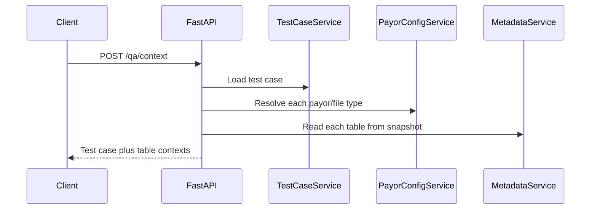
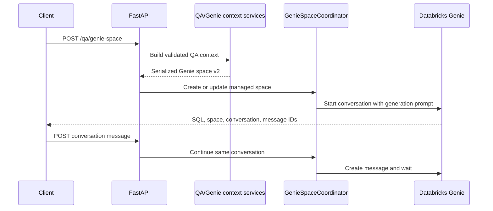

# Workflows

## 1. Browse versus refresh metadata

Unity Catalog browsing and metadata refresh are separate operations.

1. The Angular tree calls live Databricks discovery endpoints as nodes expand.
2. A metadata refresh calls `POST /metadata/refresh` for a catalog, schema, or
   table scope.
3. `MetadataService` reads the requested Unity Catalog objects and complete
   table definitions from Databricks.
4. `MetadataRepository` merges that scope into `data/metadata/metadata.json`
   and atomically replaces the file.
5. QA-context creation later reads this persisted snapshot, not live catalog
   data.

This ordering matters: a table can be visible in the live catalog browser but
still be rejected by QA context until it is refreshed into the local snapshot.

## 2. Define a health check

1. Create a test case with pipeline, component, scenario, target object, input
   data, validation check, and expected result.
2. `TestCaseService` allocates the next `TC` identifier and persists the
   definition in the configured Databricks test-case table.
3. Retrieve it by ID or list it when preparing validation context.

The test case is a business-level definition. It does not contain SQL or a
table selection until a later workflow step.

## 3. Build QA context

For every requested selection, the service checks that:

- The test case exists.
- The payor/file-type configuration exists and is unambiguous.
- Its `sql_pool_table` is defined.
- That expected table equals the selected table, case-insensitively.
- A metadata snapshot exists and contains the selected table in the selected
  catalog and schema.

The resulting `QAContext` carries the test case, the full refreshed table
metadata, the resolved expected table, and the full payor configuration. This
is the validation gate before Genie is involved.

## 4. Generate and refine SQL with Genie

`GenieContextService` includes the selected target tables plus the configured
test-case and payor-configuration tables. It emits data sources, per-column
configuration, instructions, sample questions, and SQL examples in a Genie
serialized-space v2 payload.

The coordinator serializes space updates and conversation calls with a process
lock. The managed space is shared by this FastAPI process; generating context
for one request updates that shared space before the conversation starts.

## 5. Save and execute generated SQL

1. Save the generated SQL together with its test case, target, payor/file type,
   and Genie identifiers.
2. `ValidationSQLService` creates the validation SQL Delta table if needed and
   inserts a new record with a generated ID.
3. Execute one saved record by ID.
4. `DatabricksSQLService` submits the SQL statement, polls every 250 ms, and
   returns column names, rows, status, and duration.
5. The validation service lazily creates the results Delta table and persists
   the returned result as JSON for columns and rows.

The configured SQL execution timeout defaults to 300 seconds. On timeout, the
service attempts Databricks cancellation, then verifies terminal state for up
to 10 seconds before reporting whether cancellation was confirmed.

## 6. Execute a batch

1. Submit an ordered, nonempty, duplicate-free list of saved SQL IDs.
2. The service retrieves all records first. It fails before execution when any
   requested ID is absent.
3. Queries execute in the supplied order. Each query uses the smaller of the
   per-query timeout and remaining batch time.
4. A normal SQL failure is recorded and later queries continue.
5. A confirmed query timeout is recorded and later queries continue. An
   unconfirmed cancellation, result-persistence failure, batch timeout, or
   unexpected orchestration failure marks remaining records `SKIPPED`.
6. The response returns per-query outcomes plus aggregate counts and status.

The default batch timeout is 1,800 seconds. A batch with skipped work reports
`FAILED`; a batch with failures but no skipped work reports
`COMPLETED_WITH_FAILURES`.

## Readiness checklist

Before a successful generate-and-execute session, make sure that:

1. Databricks authentication is active and has catalog, warehouse, table, and
   Genie permissions.
2. `GENIE_SPACE_TITLE` is set before FastAPI starts.
3. `DATABRICKS_WAREHOUSE_ID` is set when the managed Genie space may need to
   be created, and for SQL persistence/execution.
4. The test-case and payor-config tables contain the needed records.
5. The selected catalog/schema/table has been refreshed into the local metadata
   snapshot.
6. The selected table matches the payor configuration's `sql_pool_table`.